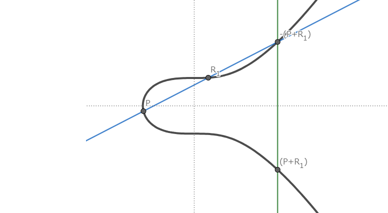

# Weil Pairing

2026/6/8改 Daiji Sanai

## １.定義 

### 1.1 基本定義
### $$e(P,Q)=\dfrac{f_P(A_Q)}{f_Q(A_P)}$$

* 点 $P$ を表す有理関数 $f_P$ を求め、その関数に点 $Q$ を表す因子 $A_Q$ を代入した値を分子とする 
* 点 $Q$ を表す有理関数 $f_Q$ を求め、その関数に点 $P$ を表す因子 $A_P$ を代入した値を分母とする
* この分数の計算値が、Weil Pairing値 ${e(P,Q)}$ となる  

ただし
* $P,Q$ は、それぞれ別の $n$ ねじれグループ上にある必要がある  
同じ楕円 $n$ ねじれグループの上の点同士ではペアリングは成立しない
* 一般的な楕円曲線では、 $n$ ねじれのグループが１グループしか存在しないため、ペアリングは成立しない
* $n$ ねじれのグループが、複数個存在する楕円曲線を見つけることは簡単ではなく、これが重要な課題である
* Weil Pairingを実用化した、Tate Pairingでは、この複数個のグループを無理やり生成する為に、拡大体を使うことになる
* ##### Weil Pairingは、有限体 $F_p$ 上の楕円曲線だけでなく、実数などを含むすべての楕円曲線を対象としている。この点が Tate Pairing との根本的な違いである。
* ##### Weil Pairingで、実際のペアリング計算を行う場合は、その計算の複雑さから、無限体（有理数体や実数体）ではなく有限体に限定して行われることが多い。（この説明でも具体的な計算方法については有限体を前提として説明する）  

### 1.2 入力と出力範囲

### $e_n: E[n] \times E[n] \to \mu_n$ 

*  $E[n]$ : ねじれ位数 $n$ になる楕円点グループの値
* ひとつめ $E[n]$ と二つ目の $E[n]$ は、別の $n$ ねじれ循環グループに属している必要がある
*  $\mu_n$ : $n$ 乗根の値（ $n$ 乗すると $1$ になる値）
* ##### ペアリングの計算結果を $n$ 乗すると必ず１になる　⇒　双線形の必須条件

---


## ２.因子[divisor]
### 2.1 基本因子 $A_P$
楕円曲線上の点 $P,Q$ を表す因子 $A_P,A_Q$ を次のように定義してみる
* $A_P=[P]-[O]$  
* $A_Q=[Q]-[O]$

### 2.2 別の因子 $D_P$

楕円曲線上の点 $P,Q$ を表す因子は     
    

* $D_P=[P+R_1]-[R_1]$ 
* $D_Q=[Q+R_2]-[R_2]$   

と定義することもできる

* 楕円曲線と交線の関係式から、 $P$ と補助点 $R_1$ を表す因子を使って求められる  
    * $[l]:[P]+[R_1]+[-(P+R_1)]-3[O]=0$
    * $[v]:[P+R_1]+[-(P+R_1)]-2[O]=0$  
    * $[l/v]:[P]+[R_1]+[-(P+R_1)]-3[O]-[P+R_1]-[-(P+R_1)]+2[O]$
    * $[P]-[O]+[R_1]-[P+R_1]=0$  
    $[P]-[O]=[P+R_1]-[R_1]$  

### 2.3 $A_P$ と $D_P$ は同値
#### [定理]  ２つの因子の差が主因子になるとき、２つの因子は同値である 

 $A_P$ と $D_P$ の差を計算してみると
* $D_P-A_P=\underline{[P+R_1]-[R_1]-[P]+[O]}$　←主因子
* $D_P \sim A_P$  

よって、先に定義した基本因子 $A_P=[P]-[O]$ は、 $D_P$ で置き換えられる

* $A_P=[P]-[O] \sim [P+R_1]-[R_1]$ 
* $A_Q=[Q]-[O] \sim [Q+R_2]-[R_2]$ 


### 2.4 定義式の変形
Weil Pairingの定義の、分子部分だけに注目し、式を変形してみる。<br>（分母部分は、PとQの入れ替えで同じように変形できる）

$$
\begin{align*}
f_P(A_Q)&=f_P(D_Q)\\
&=f_P ([Q+R_2]-[R_2])\\
&=\dfrac{f_P([Q+R_2])}{f_P([R_2])}\\
&=\dfrac{f_P(Q+R_2)}{f_P(R_2)}
\end{align*}
$$
  
※ 因子 $[Q+R_2],[R_2]$ は、それぞれ点まで分解されている因子ため、点を評価する有理関数においては、因子ではなく「点の値」を使うことができる。<br>
引数を点に変形した結果、有理関数 $f_P$ を求めることができれば、具体的な $Q,R_2$ の $x,y$ の値を代入し計算できることがわかる

---

## 3.有理関数の探索  
Weil Pairing を実現するためには、点 $P$ を表す有理関数 $f_P$ を見つける必要がある。
##### [定理]
##### 因子式が次の２つの条件を満たすとき、その因子式に相当する有理関数が存在する
1. 因子式の度数が0である
2. 因子式のカッコ[ ]を外して、楕円点の計算すると無限遠点 $O$ になる


### 3.1 基本有理関数

$P$を表す因子 $A_P=[P]-[O]$ に相当する有理関数は存在しない<br>
* 度数は０となるが、 $P-O$ は $O$ にならない 

しかし、$A_P$ を $n$ 倍すると、条件を満たし有理関数が存在するはずである。[ $n$ : ねじれ数]

$$\begin{align*}
A_P&=[P]-[O]\\
nA_P&=n[P]-n[O]　　...n倍\\
[f_P]&=n[P]-n[O]
\end{align*}
$$

探索する点 $P$ を表す有理関数 $f_P$ を

$$
{[f_P]=n[P]-n[O]}
$$

と定義する


### 3.2 直線の因子式



楕円曲線と交わる直線の関数が存在することは既知である

* 直線 $l:y= ax+b$ 
* 垂線 $v:x=c$

これらの直線 $l,v$ を因子式で記述してみる
* $[l]=[P]+[R_1]+[-(P+R_1)]-3[O]$
* $[v]=[P+R_1]+[-(P+R_1)]-2[O]$


### 3.3 $iP$ 点の主因子 [ $P$ の $i$ 倍点]

点 $P$ を表す因子 $A_P$ 、 $D_P$ の定義をもとに、点 $iP$ [ $P$ の $i$ 倍点]を表す因子を求めてみる  

* $D_P=[P+R_1]-[R_1]$  
  
因子 $D_P$ を $i$ 倍すると  
* $iD_{P} =i[P+R_1]-i[R_1]$  

また、点 $S=iP$ と置き換えると因子 $A_{S}$ は、
* $A_S=[S]-[O]$  

 $S$ を $iP$ に戻せば
* $A_{ip}=[iP]-[O]$

 $A_{ip}\sim iD_{P}$ なので、
* $[iP]-[O]=i[P+R_1]-i[R_1]$ 

ここで、 $iD_{p}$ と $A_{iP}$ の差をとると、主因子になるので
点 $iP$ を表す関数 $f_{iP}$ を次のような因子式で定義することができる 

$$
[f_{iP}]=i[P+R_1]-i[R_1]-[iP]+[O]
$$

### 3.4 $nP$ 点の主因子

[$n$ ねじれ点] $i=n$ の時の $[f_{nP}]$ を求めてみる。

$$[f_{nP}] = n[P+R_1]-n[R_1]-[nP]+[O]$$

$$= n[P+R_1]-n[R_1]-[O]+[O] \quad (\because nP = O)$$

$$= n[P+R_1]-n[R_1]$$

また、$D_P = [P+R_1]-[R_1]$ を $n$ 倍した $nD_P$ は、

$$nD_P = n[P+R_1]-n[R_1]$$

したがって、$[f_{nP}]$ と $nD_P$ は同じ値になり、

$$[f_{nP}] = nD_P$$

また、$D_P$ と $A_P$ は主因子として同値（線形同値）なので、

$$[f_{nP}] = nA_P$$

さらに、$nA_P$ は定数倍の定義より

$$nA_P = n[P]-n[O]$$

ここで、通常の関数 $f_P$ の因子（主因子）の定義は

$$(f_P) = n[P]-n[O]$$

よって、$(f_P)$ は $nA_P$ と等しく、結果として $[f_{nP}]$ とも等しくなる。

$$(f_P) = nA_P = nD_P = [f_{nP}]$$

$$f_P = f_{nP}$$

ペアリング計算の為に求めるべき有理関数 $f_P$ は、 $f_{nP}$ と同じであることが分かった。
$$
{f_P=f_{nP}}
$$

### 3.5 有理関数 $f_{nP}$ を探索する 
$$
\begin{align*}
Pのi倍点、Pのj倍点を表す&関数の因子は\\
[f_{iP}]&=i[P+R_1]-i[R_1]-[iP]+[O]\\
[f_{jP}]&=j[P+R_1]-j[R_1]-[jP]+[O]\\
f_{iP}とf_{jP}を掛け算した場合の&因子は\\
[{f_{iP}f_{jP}}]&=i[P+R_1]-i[R_1]-[iP]+[O]+j[P+R_1]-j[R_1]-[jP]+[O]\\
&=(i+j)[P+R_1]-(i+j)[R_1]-[iP]-[jP]+2[O]\\
iPとjPを通る直線の関数の&因子は\\
[l_{iP,jP}]&=[iP]+[jP]+[-(i+j)P]-3[O]\\
\\
[i+j]P点を通る垂線の関数&の因子は\\
[v_{(i+j)P}]&=[(i+j)P]+[-(i+j)P]-2[O]\\
\\
[f_{iP}f_{jP}\dfrac{l_{iP,jP}}{v_{(i+j)P}}]を計算してみ&る\\
[f_{iP}f_{jP}\dfrac{l_{iP,jP}}{v_{(i+j)P}}]&=(i+j)[P+R_1]-(i+j)[R_1]-[iP]-[jP]+2[O]\\
& +[iP]+[jP]+[-(i+j)P]-3[O]\\
& -[(i+j)P]-[-(i+j)P]+2[O]\\
\\
&=\underline{(i+j)[P+R_1]-(i+j)[R_1]-[(i+j)P]+[O]}\\
\\
Pの(i+j)倍点を表す関数の&因子は\\
[f_{(i+j)P}]&=\underline{(i+j)[P+R_1]-(i+j)[R_1]-[(i+j)P]+[O]}\\
\end{align*}
$$

$この結果、 [f_{iP}f_{jP}\dfrac{l_{iP,jP}}{v_{(i+j)P}}]　と　[f_{(i+j)P}]　が等しいことが分かる。\\よって$

### $$f_{(i+j)P}=f_{iP}f_{jP}\dfrac{l_{iP,jP}}{v_{(i+j)P}}$$

$この式から、\underline{f_{1P} を知ることができれば、再帰計算で、f_{nP} を計算できることがわかる}$


### 3.6 $f_{1P}$ を求める
※正確には、$f_{1P}(A_Q)$を求める必要がある

まず定義より、$f_{iP}$は  
$$[f_{iP}]=i[P+R_1]-i[R_1]-[iP]+[O]$$

$f_{1P}$は、$i=1$の時なので
$$[f_{1P}]=\underline{[P+R_1]-[R_1]-[P]+[O]}$$

一方で、点$P$と点$R_1$を通る直線$l_{P,R_1}$は
$$[l_{P,R_1}]=[P]+[R_1]+[-(P+R_1)]-3[O]$$

また、点$[P+R_1]$を通る垂線$v_{P+R_1}$は、

$$[v_{P+R_1}]=[P+R_1]+[-(P+R_1)]-2[O]$$

$v$を$l$で割ると

$$[\dfrac{v_{P+R_1}}{l_{P,R_1}}]=\underline{[P+R_1]-[R_1]-[P]+[O]}$$　　

となり、$[f_{1P}]$と同じになる

$$f_{1P}=\dfrac{v_{P+R_1}}{l_{P,R_1}}$$ 
正確に書けば、$A_Q$の値を入れて評価するので
$$f_{1P}(A_Q)=\dfrac{v_{P+R_1}(A_Q)}{l_{P,R_1}(A_Q)}$$ 

また $A_Q=D_Q=[Q+R_2]-[R_2]$ で置き換えできるので

$$
\begin{align*}
f_{1P}(A_Q) &= \dfrac{v_{P+R_1}([Q+R_2]-[R_2])}{l_{P,R_1}([Q+R_2]-[R_2])} \\
&= \dfrac{v_{P+R_1}([Q+R_2]) / v_{P+R_1}([R_2])}{l_{P,R_1}([Q+R_2]) / l_{P,R_1}([R_2])} \\
&= \dfrac{v_{P+R_1}([Q+R_2])}{l_{P,R_1}([Q+R_2])} \cdot \dfrac{l_{P,R_1}([R_2])}{v_{P+R_1}([R_2])}
\end{align*}
$$

略して記すと

$$
\begin{align*}
f_{1P}(A_Q) &= \dfrac{v([Q+R_2])}{l([Q+R_2])} \cdot \dfrac{l([R_2])}{v([R_2])} \\
&= \dfrac{v(Q+R_2)}{l(Q+R_2)} \cdot \dfrac{l(R_2)}{v(R_2)}
\end{align*}
$$

※ 因子 $[Q+R_2], [R_2]$ は、それぞれ「点」まで分解されている因子の形式（素因子）であるため、点を評価する有理関数においては、因子そのものではなく「点の座標値」を直接代入して扱うことができる。

これにより、$P, Q, R_1, R_2$ の座標値 $(x, y)$ はすべて既知であるため、$f_{1P}(A_Q)$ の値は以下のような実計算により有限体上で直接求めることができる。

* $P, R_1$ の $(x, y)$ 座標から、直線関数 $l$ および垂線関数 $v$ の係数（傾き $\lambda$ や切片 $\nu$）が求められる。
* 点 $(Q+R_2)$ の座標は、楕円曲線の加法公式（群法）により機械的に計算できる。
* 求まった関数 $l, v$ に対し、2つの点 $(Q+R_2)$ と $R_2$ の具体的な座標 $(x, y)$ を代入して算術計算すれば完了する。

---
## 4.具体的な計算方法
Weil Pairingを実際に計算していくとき、下記の４つの点は与えられているとする
* $P=(P.x,P.y)$
* $R_1=(R_1.x,R_1.y)$
* $Q=(Q.x,Q.y)$
* $R_2=(R_2.x,R_2.y)$

$R_1,R_2$については、もし与えられていなければ
実験的結果であるが、下記の選定方法で安定的に双線形が成立している。
* $R_1=(\dfrac{n-1}{2})P$
* $R_2=(\dfrac{n-1}{2})Q$


### 4.1 直線 $l,v$ の評価
####　4.1.1 直線 $l_{iP,jP}$


$l_{iP,jP}$は、点$iP,jP$ を通る直線なので、変数を$X,Y$として、

$$
\begin{align*}
\text{楕円曲線} \quad Y^2 = X^3+aX+b \\
\text{直線の公式} \quad Y = \lambda X+\nu \\
\text{傾き} \quad \lambda = \dfrac{\Delta y}{\Delta x} \\
\textcolor{red}{\lambda} \textcolor{red}{= \dfrac{(jP)_y - (iP)_y}{(jP)_x - (iP)_x}} \\
\text{※ただし、}(iP)\text{ と }(jP)\text{ が同じである場合、接線となり}  \\
\textcolor{red}{\lambda} \textcolor{red}{= \dfrac{3 \{(iP)_x\}^2 + a}{2 (iP)_y}} \\
\\
\text{y軸交点} \quad \nu = Y-\lambda X \\
\\
\text{X, Y に点 } (iP) \text{ を代入すると}  \\
\nu = (iP)_y - \lambda (iP)_x \\
\\
\text{よって、直線 } l \text{ は}  \\
Y = \lambda X + (iP)_y - \lambda (iP)_x \\
\text{Y を右辺に移項して}  \\
0 = \lambda X + (iP)_y - \lambda (iP)_x - Y \\
\text{評価に使う関数 } l \text{ は}  \\
l: \quad  \lambda X + (iP)_y - \lambda (iP)_x - Y \\
\\
\text{例えば、点 } Q \text{ を代入した } l \text{ の評価値は、次のように求められる}  \\
l(Q) = \lambda Q_x + (iP)_y - \lambda (iP)_x - Q_y \\
\textcolor{red}{l(Q)} \textcolor{red}{= \lambda (Q_x - (iP)_x) + (iP)_y - Q_y}
\end{align*}
$$


#### 4.1.2 直線 $v_{[i+j]P}$
<p>
  
</p>

直線 $v_{[i+j]P}$は、楕円曲線上の$[i+j]P$点を通る垂線であり、
$T=iP+jP$なる点$T$を楕円曲線の加法で求めておけば、
$$\begin{align*}
垂線の公式は、\\
X&=T.x\\
\\
Xを右辺に移項し\\
0=&T.x-X\\
求める有理関数vは\\
v:&T.x-X\\
vにQを代入し評価したい場合、\\
\textcolor{red}{v(Q)=}&\textcolor{red}{(iP+jP).x-Q.x}\\
\end{align*}
$$

このように、関数 $l(Q),v(Q)$ は、実際の各点の座標から計算することができる。 

---
### 4.2 $f_{nP}(A_Q)$ の値を計算する方法
※$f_{nQ}(A_P)$も同様の手順で求められる

前述の方法で、$f_{1P}$の値は、各点の座標値の$x,y$を使って計算することができる。
* $f_{1P}$
* 各点 $P,Q,R_1,R_2$

また、次の関数式（係数）も各座標点の$x,y$が分かれば求めることができた。
* $l_{P,R_1}()$
* $v_{P+R_1}()$

これらを応用して、$f_{1P}$を起点にして、再帰計算で、$f_{nP}$を求めることができる

<br>

#### 4.2.1 再帰式
先に求めた再帰式を利用し、Weil Pairingの計算を行う
$$f_{(i+j)P}=f_{iP}f_{jP}\dfrac{l_{iP,jP}}{v_{(i+j)P}} （略式表記）$$

実際には関数に、$Q$を表す因子$A_Q$または$D_Q$を代入するので、再帰式は
$$f_{(i+j)P}=f_{iP}f_{jP}\dfrac{l_{iP,jP}(A_Q)}{v_{(i+j)P}(A_Q)}$$  

具体的に計算に利用する再帰式は$D_Q$を代入し、変形することで次のようになる

$${f_{(i+j)P}=f_{iP}f_{jP}\dfrac{l_{iP,jP}(Q+R_2)}{v_{(i+j)P}(Q+R_2)}*\dfrac{v_{(i+j)P}(R_2)}{l_{iP,jP}(R_2)}}$$

<br>

#### 4.2.2 単純な再帰アイデア 
計算量が現実的ではないため実際には使えないが、アイデアとしては  
$f_{1P}$が既知なので、その加算を繰り返すことで$f_{nP}$を求めることができる（はず）

1. $f_{1P}$ ←既知

2. $f_{2P}=f_{(1+1)P}=f_{1P}f_{1P}\dfrac{l_{1P,1P}(Q+R_2)}{v_{2P}(Q+R_2)}*\dfrac{v_{2P}(R_2)}{l_{1P,1P}(R_2)}$
3. $f_{3P}=f_{(1+2)P}=f_{1P}f_{2P}\dfrac{l_{1P,2P}(Q+R_2)}{v_{3P}(Q+R_2)}*\dfrac{v_{3P}(R_2)}{l_{1P,2P}(R_2)}$
4. $f_{4P}=f_{(1+3)P}=f_{1P}f_{3P}\dfrac{l_{1P,3P}(Q+R_2)}{v_{4P}(Q+R_2)}*\dfrac{v_{4P}(R_2)}{l_{1P,3P}(R_2)}$
5. <繰り返し>
6. $f_{nP}=f_{(1+(n-1))P}=f_{1P}f_{(n-1)P}\dfrac{l_{1P,(n-1)P}(Q+R_2)}{v_{nP}(Q+R_2)}*\dfrac{v_{nP}(R_2)}{l_{1P,(n-1)P}(R_2)}$ 

<br>

### 4.3 ミラーアルゴリズム

$f_{nP}$の再帰計算を高速に行うアルゴリズムにミラーアルゴリズムがある。  
ねじれ点$n$を2進数にビット展開し、2倍＆加算を繰り返すことで高速な再帰計算を行う。

例　n=83の時
83は2進数で1010011である  
この2進数の上位ビットから下位ビットに向かって、2倍＆加算を繰り返し83まで再帰させる


| n=83| bin→ | 1 | 0 | 1 | 0 | 0 | 1 | 1 |  
| :--- | :--- | :---: | :---: | :---: | :---: | :---: | :---: | :---: |
| $iP$ |繰り下り| $O$ | $2P$ | $4P$ | $10P$ | $20P$ | $40P$ | $82P$
| $jP$ |$\small{1P * bit}$ |  $1P$ | $O$ | $1P$ | $O$ | $O$ | $1P$ | $1P$ |
| $(i+j)P$ |加算点 |  $\scriptsize{(0+1)P}$ | $\scriptsize{(2+0)P}$ | $\scriptsize{(4+1)P}$ | $\scriptsize{(10+0)P}$ |$\scriptsize{(20+0)P}$ |$\scriptsize{(40+1)P}$ | $\scriptsize{(82+1)P}$
| $\small{(i+j)P*2}$ |2倍点 <br>new $\small{iP}$ |  $2P$ | $4P$ | $10P$ | $20P$ | $40P$ |$82P$| $83P$

##### ※$l,v$の評価点に$O$（無限遠点）が登場した場合、評価計算が通常の方法ではできないが、この時の評価値は「$1$」とする
* $v_\infty(Q)=1$
* $l_\infty(Q)=1$

```python

# Weil Pairing one part *** ミラーアルゴリズム ***
def weil_1(P,Q):
    str_r0 = bit_str(r0)    # ねじれ数r0のビット文字列 ex. 100010111

    R1 = (r0 // 2) * P      # 補助点R1の生成
    R2 = (r0 // 2) * Q      # 補助点R2の生成

    f1 = v(P+R1,(Q+R2)) / l(P,R1,(Q+R2)) * l(P,R1,(R2)) / v(P+R1,(R2))     # fの初期値 f_{1P}
    f = f1                      # 再帰計算用変数 f 
    T = P                       # P からスタート

    # ミラーループ
    for bit_char in str_r0[1:]:     # 2文字目から最後の文字までループ（１文字目はf1計算で処理済の為）
             
        f =  f * f * l(T,T,(Q+R2)) / v(T+T,(Q+R2)) * v(T+T,(R2)) / l(T,T,(R2))                 
        T = T+T                     # Tを2Tで更新

        if bit_char == '1':
            f =  f * f1 * l(T,P,(Q+R2)) / v(T+P,(Q+R2)) * v(T+P,(R2)) / l(T,P,(R2)) 
            T = T+P                 # TをT+Pで更新

    return f        

```
---
## 補足
### 式の解釈

\[
\dfrac{v([Q+R_2])}{l([Q+R_2])} \times \dfrac{l([R_2])}{v([R_2])}
\]

これを

\[
\dfrac{v(Q+R_2)}{l(Q+R_2)} \times \dfrac{l(R_2)}{v(R_2)}
\]

で計算できる理由について説明します。

### Divisorと有理関数

1. **Divisorの役割**:
   - Divisorは、楕円曲線上の点の形式的な和であり、特定の有理関数の零点と極を記述します。
   - 各divisorは、対応する有理関数の零点と極の組み合わせを表します。

2. **関数の評価**:
   - 具体的な点 \(Q + R_2\) や \(R_2\) に対する関数 \(v\) や \(l\) の評価は、その点における関数の値を意味します。
   - 式が点を引数にしている場合、これらの関数の値はその点での直接的な評価に基づいて計算されます。

### 零点と極の分解

- **零点と極の分解**:
  - 有理関数のdivisorは、その関数の零点と極を完全に記述します。したがって、divisorが零点と極を通じて完全に分解されていると考えられます。
  - これにより、関数の評価は、特定の点での関数の値に直接関連付けられます。

### 式の評価

あなたが挙げた式が同様に計算できる理由は、これらの関数がdivisorの零点と極に基づいて評価されるためです。具体的には、各点での関数の値を使って計算することで、divisor全体の計算が同じ結果になることが保証されます。

このように、divisorが関数の零点と極に基づいて分解されているため、各点での関数の評価により、同じ結果を得ることができるのです。